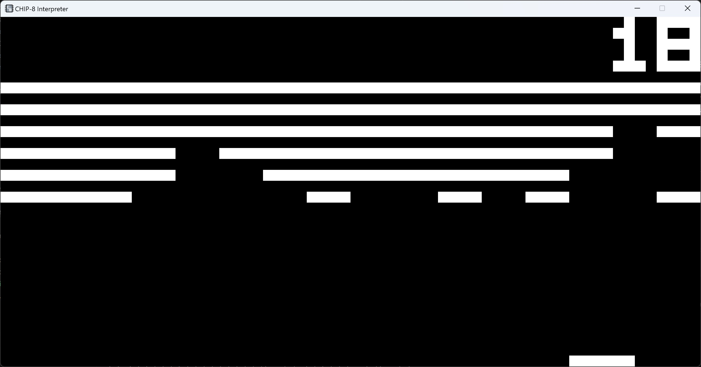

# CHIP-8 Interpreter
_A simple Rust-based interpreter for the CHIP-8_



_Above: playing Breakout by David Winter_
## About

This project is a simple interpreter for the CHIP-8 language, written in Rust and SDL2.

CHIP-8 is a simple interpreted programming language first developed in the 1970s. Initially used on the COSMAC VIP and Telmac 1800 8-bit microcomputers, the simplicity of the architecture and small instruction gave rise to a small, yet dedicated hobbyist scene for the language which persists even today. More information about the CHIP-8 itself can be found [here](http://devernay.free.fr/hacks/chip8/C8TECH10.HTM).
## How to use

To run the interpreter, either:

* Open the executable via the terminal, e.g., `./chip8_interpreter.exe ./game.ch8`
* Open the executable from the file explorer

If no game is provided as a command-line argument, a file picker will appear instead.

When playing games, keys are mapped following standard convention:

```
Original            Emulated

1 2 3 C             1 2 3 4
4 5 6 D     -->     Q W E R
7 8 9 E             A S D F
A 0 B F             Z X C V
```

The CHIP-8 has no standardised clock speed. The default is 600Hz (10 instructions per frame at 60fps), however you can adjust this with `-` and `+`.

You can save/load the CPU state with `O` and `P` respectively.

The interpreter supports sound emulation.

## Build instructions
To build a copy of this interpreter yourself, first install `rustup` (if you haven't already), set up `rust-sdl2` (see instructions [here](https://github.com/Rust-SDL2/rust-sdl2#windows-with-build-script)), then run `cargo build`. You will need to supply a copy of `SDL2.dll` in the same directory as the executable in order to run the interpreter.

## Change history
* v1.0.0 - Save states and speed adjust
* v0.9.0 - First commit, main emulator functionality complete

Future work: instruction set enhancements, palette toggle, AZERTY keyboard support, controller support.